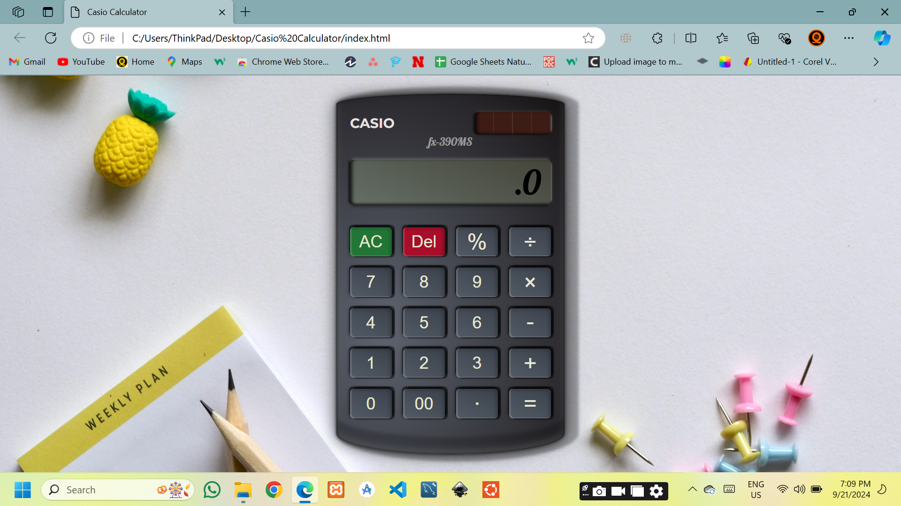

# CASIO-Style-Calculator-with-HTML-CSS-and-JavaScript

In this tutorial, we’ll build a Realistic CASIO-style calculator using HTML, CSS, and JavaScript. We’ll go through every step, from designing the calculator's layout to implementing its core functionality like addition, subtraction, multiplication, division, and more. Perfect for beginners looking to improve their web development skills! 🚀

### What You'll Learn:

- Creating a visually appealing UI with CSS (including radial gradients and shadows)
- Implementing calculator logic with JavaScript
- Handling events for calculator buttons
- Error handling for invalid operations
- How to add interactivity with blinking placeholders and animations

👨‍💻 Skills: HTML, CSS, JavaScript

[Youtube](https://youtu.be/H7QbMMwG7_o)

### Images

